<p align="center">
    
</p>
<h1 align="center" style="margin: 20px 30px 0px 30px; font-weight: bold;">XiaoShiLiu</h1>

---
<p align="center">
    <b>基于 Express + Vue 前后端分离仿小红书项目</b>
</p>
<p align="center">
    <i>一个高仿小红书的图文社区项目，支持图文发布、社交互动等核心功能，旨在提供从前端到后端的完整实践范本</i>
</p>
<p align="center">
    <a href="https://www.shiliu.space">演示网站</a> · <a href="https://www.shiliu.space/doc">在线文档</a> · <a href="https://www.bilibili.com/video/BV1J4agztEBX/?spm_id_from=333.1387.homepage.video_card.click">视频介绍</a>
</p>
<p align="center">
    <a href="https://github.com/ZTMYO/XiaoShiLiu">简体中文</a>|<a href="doc/i18n/README_En.md">English</a>|<a href="doc/i18n/README_zh-Hant.md">繁體中文</a>
</p>

<p align="center">
    <a href="https://github.com/ZTMYO/XiaoShiLiu/stargazers">
        
    </a>
    <a href="https://github.com/ZTMYO/XiaoShiLiu/network/members">
        
    </a>
    <a href="https://github.com/ZTMYO/XiaoShiLiu">
        
    </a>
    <a href="https://github.com/ZTMYO/XiaoShiLiu/blob/master/LICENSE">
        
    </a>
</p>
<p align="center">
    
    
</p>

> **声明**  
> 本项目基于 [GPLv3 协议](./LICENSE)，免费开源，仅供学习交流，禁止转卖，谨防受骗。如需商用请保留版权信息，确保合法合规使用，运营风险自负，与作者无关。

---

> 📁 前端位于 `vue3-project/`，后端位于 `express-project/`，详见[项目结构文档](./doc/PROJECT_STRUCTURE.md)。

## 项目展示

### PC端界面

<table>
  <tr>
    <td>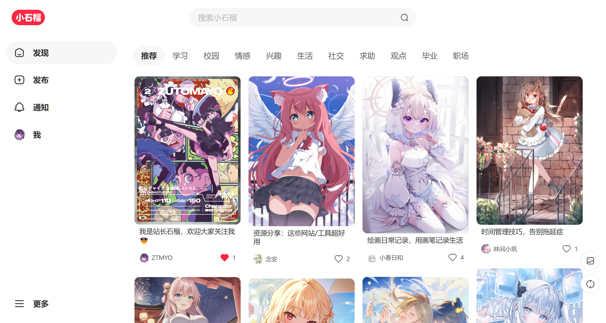</td>
    <td>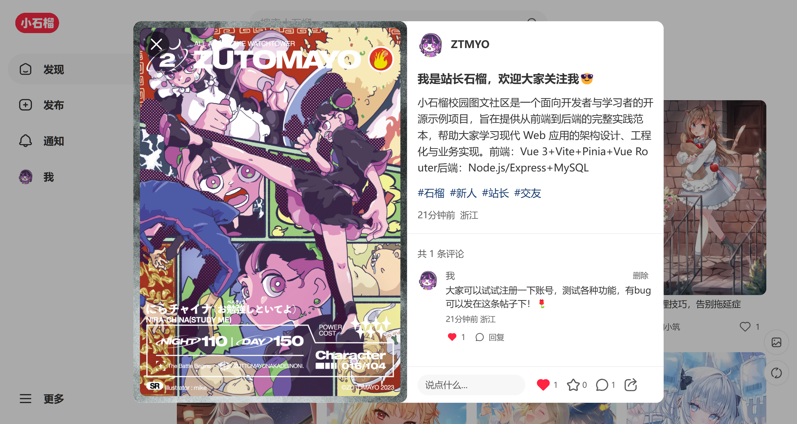</td>
    <td>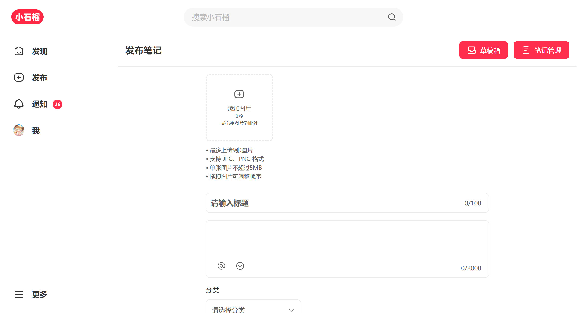</td>
  </tr>
  <tr>
    <td>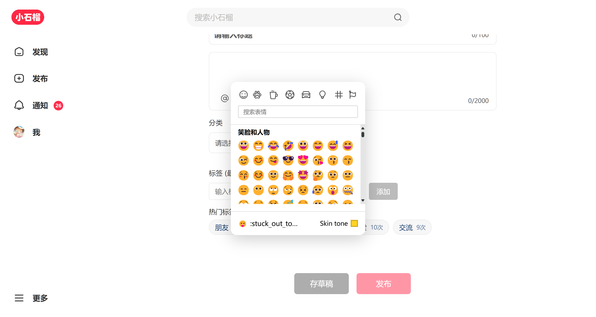</td>
    <td>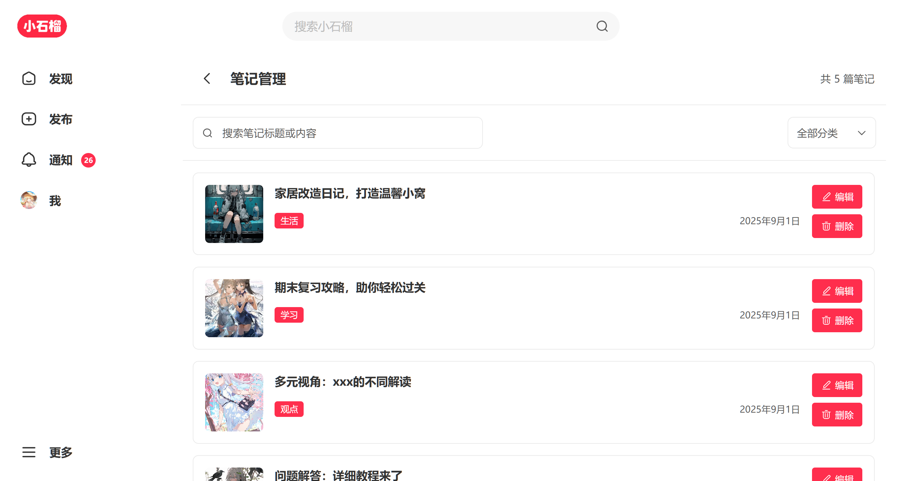</td>
    <td>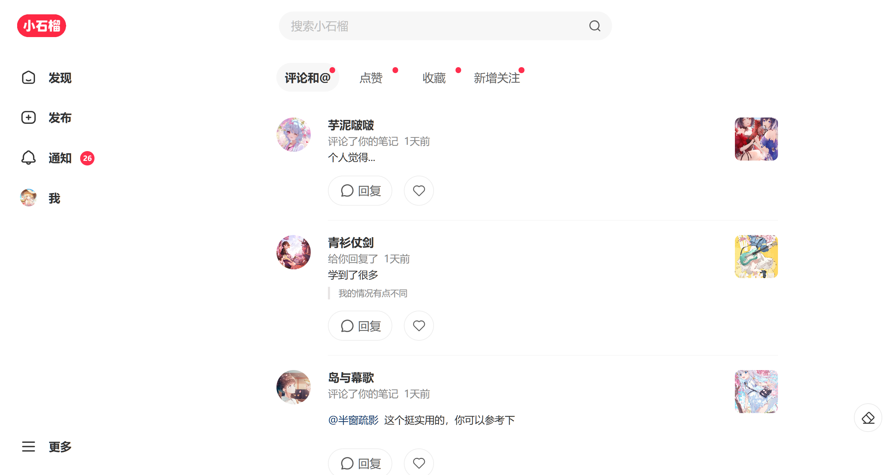</td>
  </tr>
  <tr>
    <td>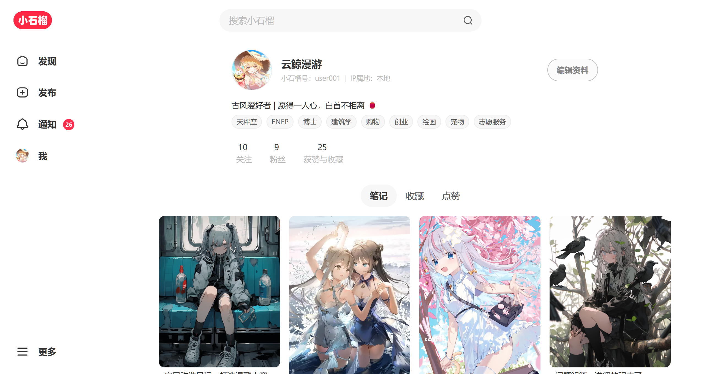</td>
    <td>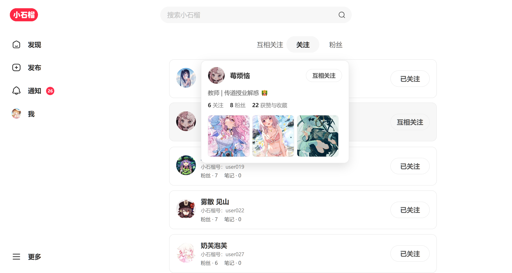</td>
    <td>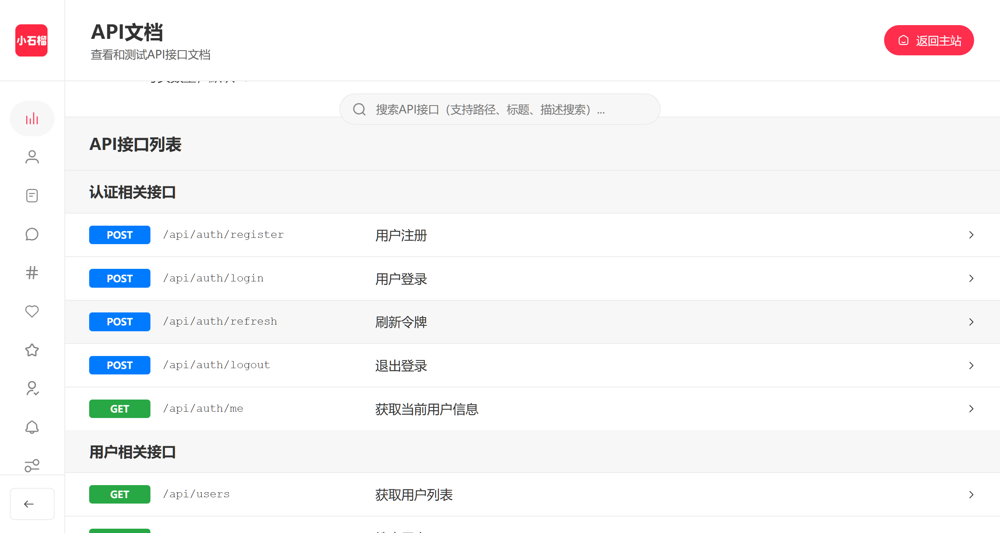</td>
  </tr>
  <tr>
    <td>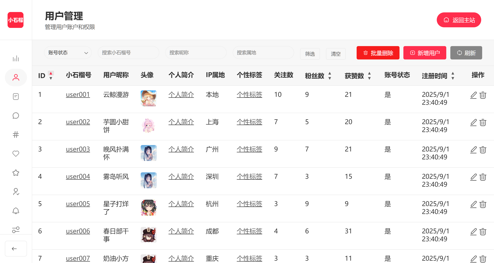</td>
    <td>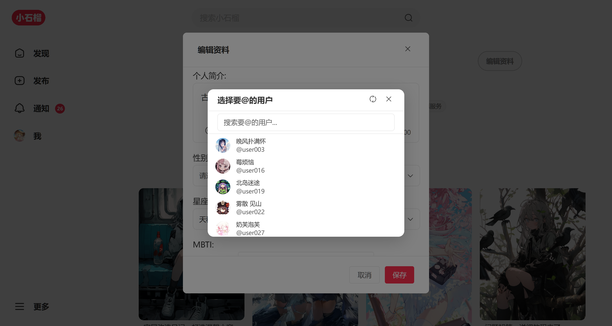</td>
    <td>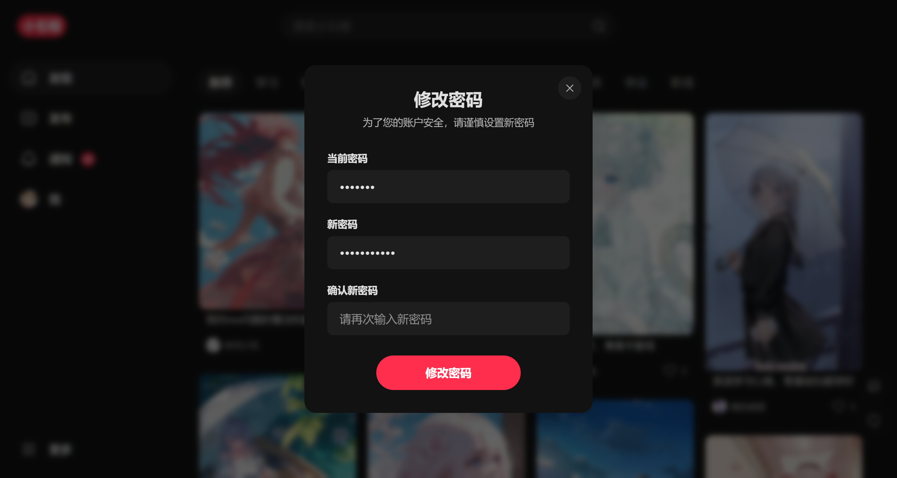</td>
  </tr>
  <tr>
    <td></td>
    <td></td>
    <td></td>
  </tr>
  <tr>
    <td></td>
    <td></td>
    <td></td>
  </tr>
</table>

### 移动端界面

<table>
  <tr>
    <td>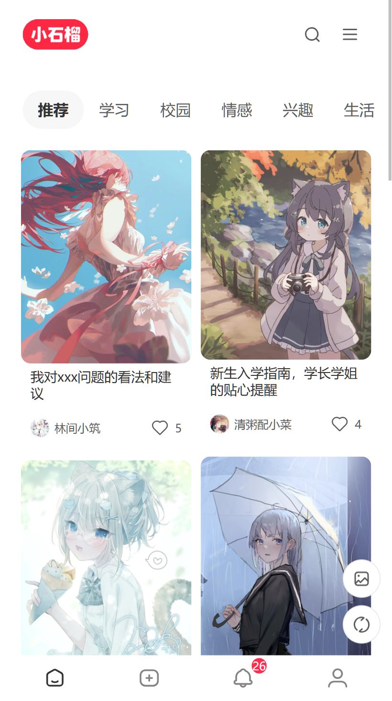</td>
    <td></td>
    <td>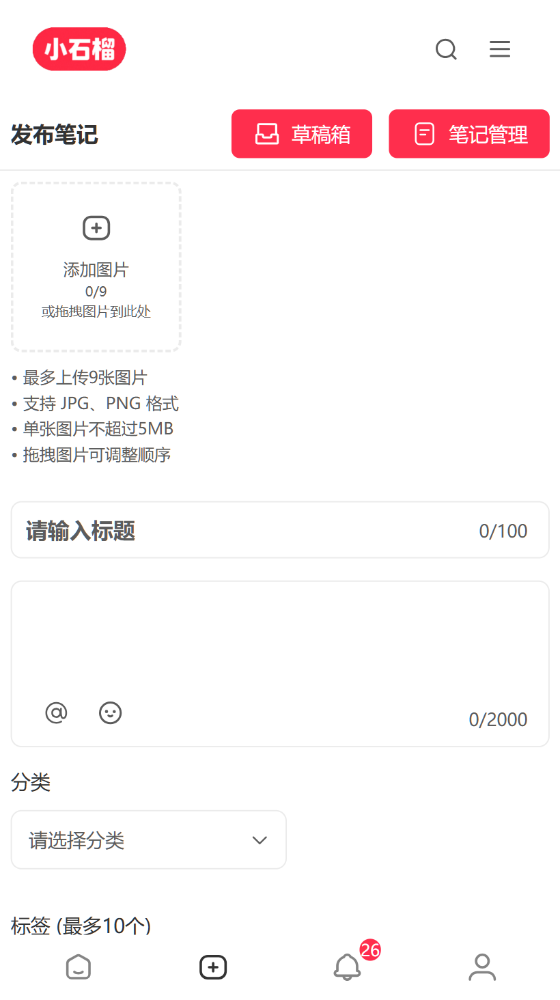</td>
    <td>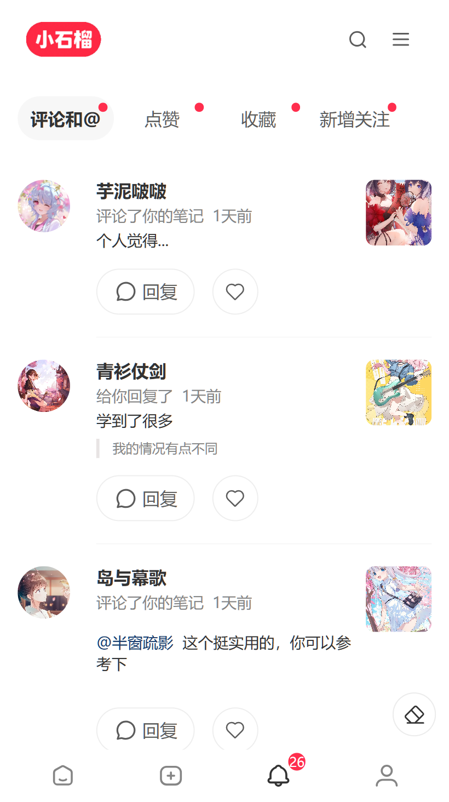</td>
  </tr>
  <tr>
    <td>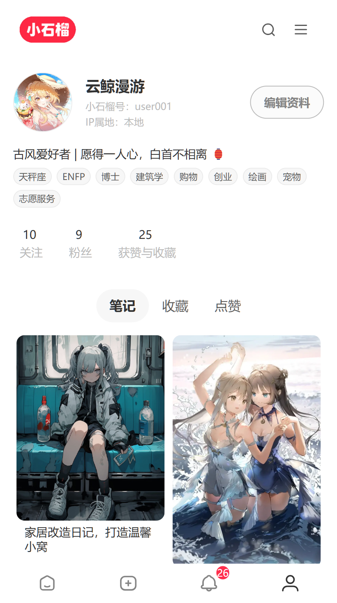</td>
    <td>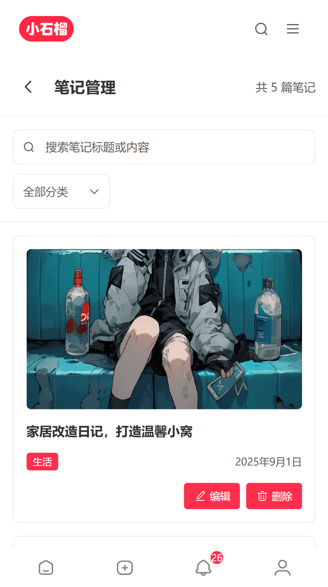</td>
    <td>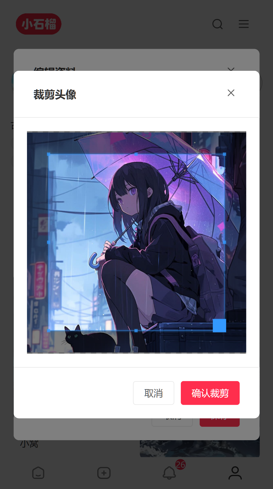</td>
    <td>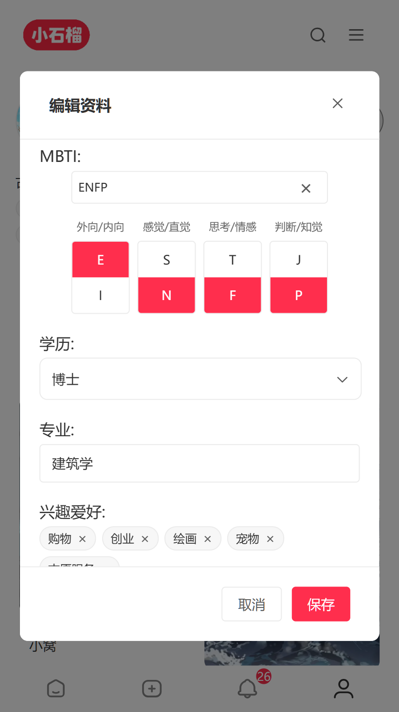</td>
  </tr>
  <tr>
    <td></td>
    <td></td>
    <td></td>
    <td></td>
  </tr>
</table>

## 项目文档

| 文档 | 说明 |
|------|------|
| [部署指南](./doc/DEPLOYMENT.md) | 部署配置和环境搭建说明 |
| [项目结构](./doc/PROJECT_STRUCTURE.md) | 项目目录结构架构说明 |
| [数据库设计](./doc/DATABASE_DESIGN.md) | 数据库表结构设计文档 |
| [API接口文档](./doc/API_DOCS.md) | 后端API接口说明和示例 |

## 项目亮点

- **工程化：** 环境配置、代码规范、构建与产物优化的完整流程
- **业务能力：** 鉴权流程、路由守卫、状态管理与接口封装
- **体验优化：** 骨架屏、懒加载、预加载、无障碍与响应式适配
- **组件与分层：** 可复用组件拆分、按领域分组与别名引入
- **后台管理：** 基础CRUD、数据管理与配置面板，支持后续扩展权限与统计
- **快速部署：** 基于 Docker 的一键部署方案，支持多环境配置与自动化部署

## 技术栈

> 💡点击可展开查看详细内容
<details>
<summary><b>前端技术</b></summary>

- **Vue.js 3** - 前端框架（Composition API）
- **Vue Router 4** - 路由管理
- **Pinia** - 状态管理
- **Vite** - 构建工具和开发服务器
- **Axios** - HTTP客户端
- **VueUse** - Vue组合式工具库
- **CropperJS** - 图片裁剪
- **Vue3 Emoji Picker** - 表情选择器
- **svg-captcha** - 验证码生成器
</details>

<details>
<summary><b>后端技术</b></summary>

- **Node.js** - 运行环境
- **Express.js** - Web框架
- **MySQL** - 数据库
- **JWT** - 身份认证
- **Multer** - 文件上传
- **bcrypt** - 密码加密
- **CORS** - 跨域资源共享

</details>

## 第三方API
- **图片存储：** 灌装的示例图片来自 [栗次元图床](https://t.alcy.cc/)，提供稳定的图片存储服务
- **图片上传：** 用户上传图片使用了 [夏柔API](https://api.aa1.cn/doc/360tc.html)，确保图片上传的稳定性和速度
- **属地查询：** IP属地查询服务使用 [保罗API](https://api.pearktrue.cn/console/detail?id=290)，实现精准的IP属地定位功能

## 环境要求

| 组件 | 版本要求 |
|------|----------|
| Node.js | >= 18.0.0 |
| MySQL | >= 5.7 |
| MariaDB | >= 10.3 |
| npm | >= 8.0.0 |
| yarn | >= 1.22.0 |
| 浏览器 | 支持 ES6+ |

> 上述为传统本地开发的最低版本要求；Docker 部署的镜像版本与前置条件见[部署指南](./doc/DEPLOYMENT.md)。

## 快速开始

### 1. 环境配置

前后端各有一份 `.env`，从对应目录的 `.env.example` 复制。后端 `express-project/.env` 至少确认以下四项：

```env
DB_PASSWORD=123456                      # 数据库密码
JWT_SECRET=xiaoshiliu_secret_key_2025   # JWT 密钥，生产环境务必更换
API_BASE_URL=http://localhost:3001      # 后端对外访问地址
CORS_ORIGIN=http://localhost:5173       # 允许跨域的前端地址
```

前端 `vue3-project/.env` 只需确认 `VITE_API_BASE_URL` 指向后端 API（默认 `http://localhost:3001/api`）。

其余变量（上传策略、邮件、IP 属地、违规词检测等）保持默认即可：完整列表见 [express-project/.env.example](./express-project/.env.example) 与 [vue3-project/.env.example](./vue3-project/.env.example)，各项含义见[部署指南](./doc/DEPLOYMENT.md)。

### 2. 安装依赖

```bash
npm install
```

### 3. 启动开发服务器

```bash
npm run dev
```

开发服务器默认运行在 `http://localhost:5173`。

### 4. 构建生产版本

```bash
npm run build     # 构建到 dist/
npm run preview   # 本地预览，默认 http://localhost:4173
```

## Star历史

[](https://www.star-history.com/#ZTMYO/XiaoShiLiu&Date)

---

<div align="center">

Copyright © 2025 - **XiaoShiLiu**\
By ZTMYO\
Made with ❤️ & ⌨️

</div>
